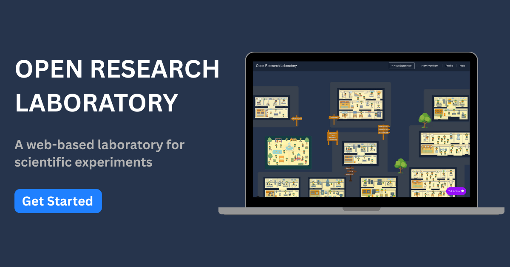

# Hello from Open Research Laboratory

Welcome to the **Open Research Laboratory** A Virtual Laboratory for the Next Generation of Scientists and researchers. 

**Open Research Laboratory** is a web-based, interactive platform that empowers individuals across the globe to perform scientific experiments entirely online. 

Built by **Necrozma Labs**, this platform is engineered to eliminate barriers in experimentation — making scientific research more accessible, reproducible, and collaborative than ever before.

:::tip info
See original Blog Post at [Necrozma Labs](https://www.necrozmalabs.com/openresearchlaboratory)
:::

{/* truncate */}

## How it works? 

Within the Open Research Laboratory, users can explore a wide range of scientific domains — from quantum computing and classical physics to data science and AI-based modeling. The lab interface includes a growing collection of virtual equipment and components, available directly through an intuitive dashboard.

To run an experiment, simply choose your desired components on the lab page, enter the required input parameters, and execute your setup with one click. The results are displayed in real time — whether it is a graph, simulation output, or numerical result. You can also save, edit, and share your experiments with others through the platform.  

Our mission is simple: **empower researchers, students, and innovators to accelerate discoveries and push the boundaries of scientific understanding.**  

:::info 
Visit Open research Laboratory [here](https://openresearchlaboratory.necrozmalabs.com) or Get Started [here](/docs/welcome)
:::