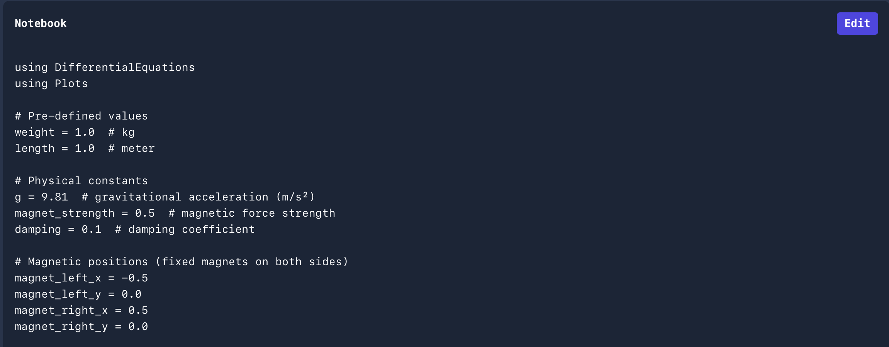
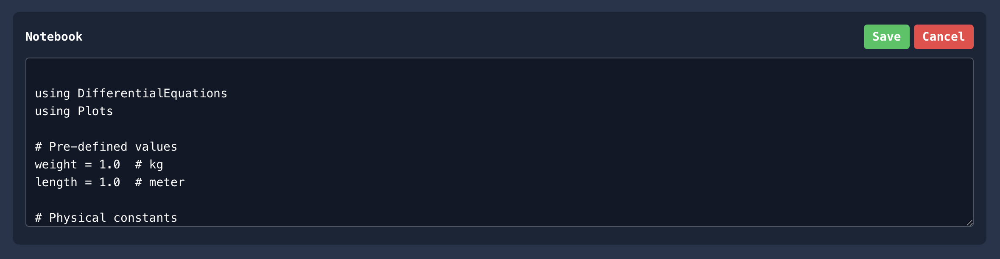

# Introducing Code View & Editing for Experiments 🔬

We are excited to announce a **major new update** in the **Open Research Laboratory**:  
you can now **view the exact code** used to execute your experiments, and even **modify or rewrite it** according to your needs.  

This update gives researchers more **flexibility, transparency, and control** over their scientific workflows — making every experiment more **customizable, reproducible, and research-ready**.  

{/* truncate */}

Being able to access and edit the experiment’s underlying code unlocks powerful opportunities for researchers. It allows full customization, enabling you to fine-tune parameters, adjust logic, or completely redesign your workflow. At the same time, it provides transparency, giving you a clear understanding of how results are generated and ensuring reproducibility.

This feature also makes it easier to incorporate code snippets directly into research papers, strengthening the credibility of your findings. Finally, by sharing modified experiments with peers, you can foster greater collaboration and accelerate collective scientific progress.

In short: your experiments are no longer black boxes. You have **full visibility and control**.

# How It Works

1. **Run any experiment** in the Open Research Laboratory.  
2. **Click on dive deep** section.  
3. Inspect the underlying code used to execute your setup.  
4. **Modify or replace** parts of the code.  
5. **Re-run your experiment** with the updated logic and observe new results.  

It’s that simple. What was once static is now **interactive and dynamic**.  

:::note Walkthrough

Click on this option `Want to dive deeper? Click to see the notebook`

You will see your Code in `julia` in a notebook 

You can edit this by click on `edit` option

Click on `save` to run your experiment

:::

We believe this feature will transform how experiments are conducted in the Open Research Laboratory. Whether you are writing a research paper, teaching students and colleagues, running independent investigations, or building the next breakthrough innovation, this update ensures you have the tools and flexibility to achieve your goals. 

# Final Words

This is just the beginning of giving researchers more **freedom and power** inside the Open Research Laboratory. We can’t wait to see how you use **Code View & Editing** to push the boundaries of your work.  

**Try it today, and start shaping your experiments your way.** 