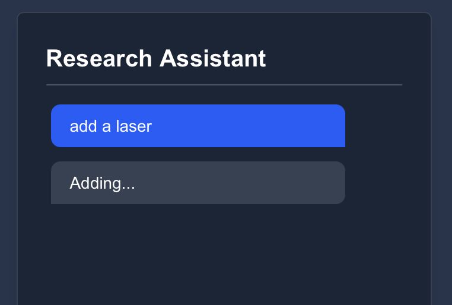
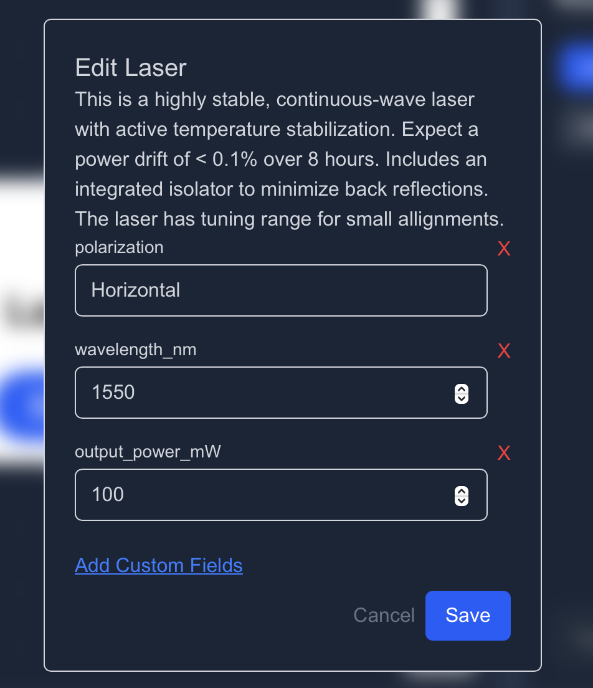

# How to Add components in your workflow using View 

The **View Research Assistant** allows researchers to add and configure workflow components just by typing natural language commands.  

:::tip 
With View, you don’t need to manually configure everything — simply tell it what you want, and it helps you set up the component.
:::

## Steps of adding a component in workflow
### Step 1: Ask View to Add a Component

Type your request in plain language, for example:

```
add a laser
```


View will interpret your request and automatically generate a component popup with suggested inputs and values.

#### Here are some visuals

|  |  | 
|-------------------------------|-------------------------------|
| View Command                    | Component popup


### Step 2: Review the Suggested Inputs

The popup will display all the input fields that View generated for the component.

- Each input includes a label, type, and hint (if available).
- You can adjust the values directly if needed.

:::tip INFO
You can give your custom values here.
:::

### Step 3: Delete Irrelevant Inputs

If you don’t need a particular input, simply click the **X** button next to it.  
The input will be removed from the workflow and will not be saved.


### Step 4: Add Your Own Custom Values

Sometimes you’ll want to add extra fields not included by default.  
Click **Add Custom Fields** and enter your own field name and value.

- Custom fields appear in the preview list.  
- You can remove or change them anytime before saving.


### Step 5: Save the Component

Once satisfied with your configuration:

1. Click **Save**.  
2. View will store the component in your workflow.  
3. A confirmation alert will notify you that the component was updated.

---

## Add a Custom Component (Optional)

If you want to bring in **your own unique component** (not predefined), simply type:

```
add a custom component
```

View will open a popup where you can define everything from scratch.  
This lets you extend your workflow with **any custom-built logic or experiment setup**.


## Creating Components with Predefined and Custom Values

When creating a component, you can either rely on predefined inputs (defaults provided by the system) or override them with your own inputs.

To do this with View, you can simply type like this:
```
add a laser with wavelength 1550 nm and plarization linear 

```
Once inputs are set, the view dynamically generates the component with the chosen configurations.


## Summary

With View, you can:
- Add components via natural language (`add a laser`).  
- Review and edit suggested inputs.  
- Delete irrelevant values.  
- Add custom fields and values.  
- Insert entirely custom components.  

This makes it easy for researchers to quickly experiment, iterate, and build complex workflows without needing to manually configure every detail.
