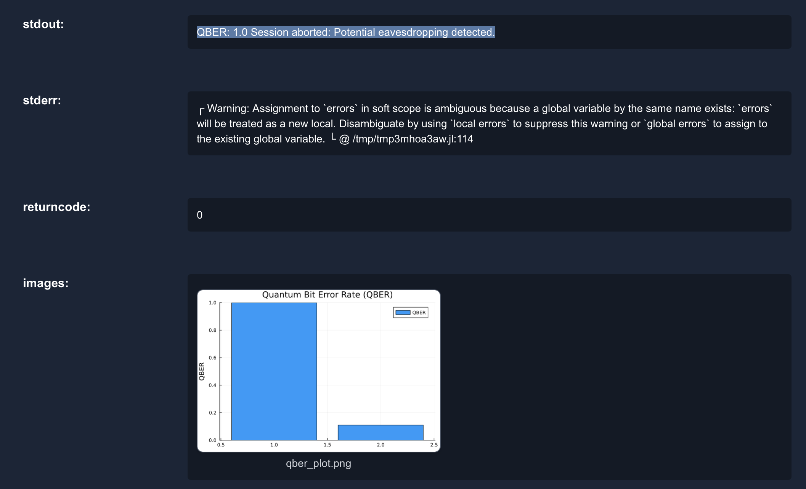

# Custom QKD Protocol with Three Bases

This tutorial explains how to create and simulate a **custom Quantum Key Distribution (QKD) protocol with three bases** using the **Quantum Communication Lab** inside Open Research Laboratory.

:::info Prerequisites
- An active **Open Research Laboratory** account  
- Access to the **Quantum Communication Lab**  
- Basic understanding of QKD concepts  

:::

## Creation steps of Custom QKD Protocol with Three Bases
#### Step 1: Start

#### Log in and Create a New Workflow

1. Log in to **Open Research Laboratory**.  
2. Navigate to the **Quantum Communication Lab**.  
3. Click **Create New Workflow**.  
4. Enter a workflow name, e.g.:


#### Step 2: Add Components
Add the following components and parameters:

| Component        | Value / Setting |
|------------------|-----------------|
| Photon Source    | Wavelength = 1550 nm, Repetition Rate = 100 MHz, Polarization: "Basis 1: Rectilinear (0°, 90°) Basis 2: Diagonal (45°, 135°) Basis 3: Circular (Right, Left)" |
| Channel (Satellite) | Length = 100 km, Loss = 20 dB/km , noise= -20dBm, Polarization Drift= 0.001|
| Detector         | Efficiency = 70%, Dark Count = 100, Dead Time = 50 ns |


#### Step 3: Add Research Details
Describe the protocol execution:

:::info info 

You can add your information about execution in the Description option of ```Research Details```
:::

For this We will add: 
```
Protocol Execution
Step 1: Preparation
Alice generates a random sequence of bits.
For each bit, Alice randomly selects one of three bases and encodes the bit in a photon with the chosen polarization.
Step 2: Transmission
Photons are sent from the satellite to Bob on the ground.
Due to channel loss and noise, not all photons may be detected.
Step 3: Measurement
Bob randomly chooses a basis (one of the three) to measure each incoming photon.
He records the result and the chosen basis.
Step 4: Basis Reconciliation
Alice and Bob communicate over the classical channel to compare which bases were compatible.
Only the bits where Alice’s and Bob’s bases match are kept (sifted key).
Bits measured in mismatched bases are discarded.
Step 5: Error Estimation
Alice and Bob publicly compare a small sample of the sifted key to estimate the Quantum Bit Error Rate (QBER).
If QBER exceeds a threshold (e.g., 11% for 3 bases), the session is aborted due to potential eavesdropping.

```


#### Step 4: Run the Simulation
- Click **Run** inside the workflow editor.  
- The lab simulates photon generation, channel effects, and key exchange.  

## Our Result

Code Executed in ORL 

```julia
using Plots

# Pre-defined values
loss_db_per_km = 20
added_noise_dbm = -20
channel_length_km = 100
polarization_drift_rate = 0.001
detector_efficiency = 70
dark_count_rate = 100

# Derived channel parameters
total_loss = loss_db_per_km * channel_length_km
transmission_prob = 10^(-total_loss / 10)
noise_prob = 10^(added_noise_dbm / 10)

# Simulation parameters
num_bits = 10000
qber_threshold = 0.11

# Step 1: Preparation - Alice generates random bits and bases
alice_bits = rand(0:1, num_bits)
alice_bases = rand(1:3, num_bits)

# Photon encoding with polarization
function encode_photon(bit, base)
    if base == 1
        return bit == 0 ? 0 : 90
    elseif base == 2
        return bit == 0 ? 45 : 135
    else
        return bit == 0 ? 1 : -1  # Right = 1, Left = -1 for circular
    end
end

# Step 2: Transmission with loss and noise
transmitted_photons = Int[]
transmitted_bases = Int[]
transmitted_indices = Int[]

for i in 1:num_bits
    if rand() < transmission_prob
        push!(transmitted_photons, encode_photon(alice_bits[i], alice_bases[i]))
        push!(transmitted_bases, alice_bases[i])
        push!(transmitted_indices, i)
    end
end

# Step 3: Measurement - Bob randomly chooses a basis and measures
bob_bases = rand(1:3, length(transmitted_photons))
bob_results = Int[]

for i in 1:length(transmitted_photons)
    photon = transmitted_photons[i]
    base = bob_bases[i]
    detected = rand() < detector_efficiency / 100
    dark_count = rand() < dark_count_rate / 1e9

    if dark_count
        push!(bob_results, rand(0:1))
    elseif detected
        if base == 1
            if photon == 0
                push!(bob_results, 0)
            elseif photon == 90
                push!(bob_results, 1)
            else
                push!(bob_results, rand(0:1))  # Random guess
            end
        elseif base == 2
            if photon == 45
                push!(bob_results, 0)
            elseif photon == 135
                push!(bob_results, 1)
            else
                push!(bob_results, rand(0:1))
            end
        else
            if photon == 1
                push!(bob_results, 0)
            elseif photon == -1
                push!(bob_results, 1)
            else
                push!(bob_results, rand(0:1))
            end
        end
    else
        push!(bob_results, -1)  # Lost photon
    end
end

# Step 4: Basis Reconciliation
sifted_alice_bits = Int[]
sifted_bob_bits = Int[]

for i in 1:length(transmitted_bases)
    if transmitted_bases[i] == bob_bases[i] && bob_results[i] != -1
        push!(sifted_alice_bits, alice_bits[transmitted_indices[i]])
        push!(sifted_bob_bits, bob_results[i])
    end
end

# Step 5: Error Estimation
sample_size = min(100, length(sifted_alice_bits))
if sample_size > 0
    sample_indices = rand(1:length(sifted_alice_bits), sample_size)
    errors = 0
    for i in sample_indices
        if sifted_alice_bits[i] != sifted_bob_bits[i]
            errors += 1
        end
    end
    qber = errors / sample_size
else
    qber = 1.0
end

# Plot QBER and threshold
p1 = plot([qber, qber_threshold], label=["QBER" "Threshold"], seriestype=:bar, legend=:topright, ylabel="QBER", title="Quantum Bit Error Rate (QBER)")
savefig(p1, "qber_plot.png")

# Print result
println("QBER: $qber")
if qber > qber_threshold
    println("Session aborted: Potential eavesdropping detected.")
else
    println("Key established successfully.")
end
```

:::note Our Results



:::
### Justification of Result

In this simulation, the **Quantum Bit Error Rate (QBER)** exceeded the predefined threshold of **11%**.  And we have given in the Description that if the QBER surpasses this limit, it is automatically set to **100%**, and the session is marked as **aborted due to high QBER**.  

This reflects realistic QKD behavior:  
- A high QBER strongly indicates **excessive noise, channel errors, or potential eavesdropping**.  
- Aborting the session ensures that **no insecure keys** are established.  

By enforcing this strict cutoff, the system maintains the **security integrity** of the protocol.

:::tip Pro Tip
You can click on the **“View Your Notebook”** option above the result to inspect the **execution code** used for your experiment.  

This allows you to:  
- Review the logic behind the simulation  
- **Modify parameters** such as channel loss, noise level, or detector efficiency  
- **Re-run the experiment** to observe how changes impact the QBER and final outcome  
:::

## Futher Enhancement of Tutorial 

- Use realistic loss values (0.2 dB/km fiber, or 30–40 dB free-space).
- Convert noise in dBm → photon detection probability properly.
- Add dead time & afterpulsing in detector simulation.
- Implement error correction (Cascade/LDPC).
- Implement privacy amplification and compute final secure key rate.
- Scale simulation to 10⁶–10⁸ bits for statistical accuracy.
