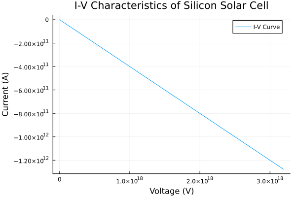
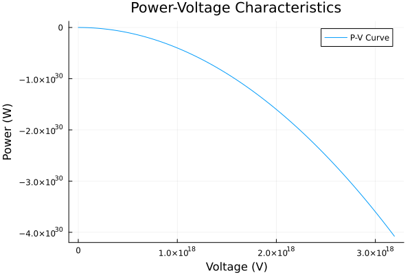

import Tabs from '@theme/Tabs';
import TabItem from '@theme/TabItem';

# Creating a Silicon Solar Cell in Open Research Laboratory 


This documentation provides a detailed overview of a **research-grade silicon solar cell** fabricated and tested in our **Open Research Laboratory**. 
:::info
It includes the objectives of the study, the solar cell stack, testing results, and interactive tabs for experimental curves.
:::

## About the Solar Cell

The cell is a monocrystalline silicon solar cell, optimized for high efficiency using standard layers including anti-reflective coating, passivation layers, and front/rear contacts. This solar cell is designed and fabricated in the **Open Research Laboratory**.

## Objectives of this Research

The main objectives of this experiment are:  

1. To simulate and measure the **IV curve** of the silicon solar cell under controlled laboratory conditions.  
2. To calculate the **efficiency** of the solar cell in different environmental factors such as **humidity, temperature, and light intensity**.  
3. To evaluate the influence of **layer thickness and material properties** on the performance of the solar cell.  


## Solar Cell Stack Configuration

| Layer Name | Material | Thickness | Structure | Bandgap | Purpose |
|------------|---------|----------|-----------|---------|---------|
| Anti-Reflective Coating (ARC) | Si₃N₄ | 70 nm | PECVD thin film | 5.3 eV | Maximize light absorption |
| Front Contact (Metal Grid + TCO) | ITO (100 nm) + Silver grid (3 µm) | 100 nm / 3 µm | Transparent conductive oxide + metal fingers | 3.5 eV | Conduct electricity with minimal shading |
| Passivation Layer | Al₂O₃ | 30 nm | Covers emitter layer | 6.5 eV | Reduce surface recombination |
| n-type Emitter Layer | Phosphorus-doped silicon | 1 µm | Heavily doped top layer | 1.12 eV | Generate electrons and form p-n junction |
| p-type Base Layer | Boron-doped silicon | 180 µm | Bulk wafer | 1.12 eV | Collect holes and provide mechanical support |
| Rear Passivation Layer | SiO₂ | 70 nm | Full back coverage | 9 eV | Minimize back surface recombination |
| Back Contact | Aluminum | 150 nm | Full-area metallization | 0 eV | Complete circuit and reflect unabsorbed light |

---
## Creating in ORL 

To create this experiment in open research laboratory, we have used the following:

<Tabs
  defaultValue="components"
  values={[
    {label: 'Components', value: 'components'},
    {label: 'Research Details', value: 'research-details'},
  ]}>

<TabItem value="components">

Components we have used 

```json
{
  "Anti-Reflective Coating (ARC)": {
    "Material": "Si₃N₄",
    "Thickness": "70 nm",
    "Structure": "PECVD thin film",
    "Bandgap": "5.3 eV",
    "Purpose": "Reduce reflection, maximize light absorption"
  },
  "Front Contact (Metal Grid + TCO)": {
    "Material": "ITO (100 nm) + Silver grid (3 µm)",
    "Structure": "Transparent conductive oxide with metal fingers",
    "Bandgap": "3.5 eV",
    "Purpose": "Conduct electricity while allowing light to pass"
  },
  "Passivation Layer": {
    "Material": "Al₂O₃",
    "Thickness": "30 nm",
    "Structure": "Covers emitter layer except contacts",
    "Bandgap": "6.5 eV",
    "Purpose": "Reduce surface recombination"
  },
  "n-type Emitter Layer": {
    "Material": "Phosphorus-doped silicon",
    "Thickness": "1 µm",
    "Structure": "Heavily doped top surface",
    "Bandgap": "1.12 eV",
    "Purpose": "Generate electrons, form p-n junction"
  },
  "p-type Base Layer": {
    "Material": "Boron-doped silicon",
    "Thickness": "180 µm",
    "Structure": "Bulk lightly doped wafer",
    "Bandgap": "1.12 eV",
    "Purpose": "Collect holes, provide mechanical support"
  },
  "Rear Passivation Layer": {
    "Material": "SiO₂",
    "Thickness": "70 nm",
    "Structure": "Full coverage at wafer back",
    "Bandgap": "9 eV",
    "Purpose": "Reduce back-surface recombination"
  },
  "Back Contact": {
    "Material": "Aluminum",
    "Thickness": "150 nm",
    "Structure": "Full-area metal contact",
    "Bandgap": "0 eV",
    "Purpose": "Complete circuit, reflect unabsorbed light"
  }
}
```

</TabItem>
<TabItem value="research-details">

Research Description

```
this is a basic silicon solar cell, find out the efficiency of conversion rate and other things. this cell is 2*2 cm. find the stability of the layers due to humidity and other factors. Make IV graph and conversion rate graph + efficiency graph too.
```
</TabItem>
</Tabs>

---
## Results we got

<Tabs
  defaultValue="iv"
  values={[
    { label: 'I-V Curve', value: 'iv' },
    { label: 'Power Curve', value: 'power' }
  ]}>

<TabItem value="iv">



</TabItem>

<TabItem value="power">



</TabItem>

</Tabs>

---

## Run Workflow
:::tip Want to Try It Yourself?

If you want to replicate this experiment or customize it, we have made the workflow publicly available in our Open Research Laboratory.
You can:
- Run a Copy: Simply click on Run a Copy of our QKD workflow.
- Modify & Execute: Make any desired modifications and execute the experiment on your own.

This allows you to leverage our pre-configured setup without starting from scratch.

::::info Steps to Run
1. Visit Open Research Laboratory.
2. Navigate to the Workflows page.
3. Select the Silicon Solar Cell Workflow.
4. Click on Run – this will create a duplicate of the workflow for your use.
5. Run the experiment directly on your virtual lab environment.

::::


